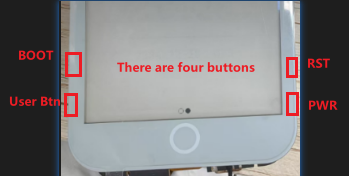
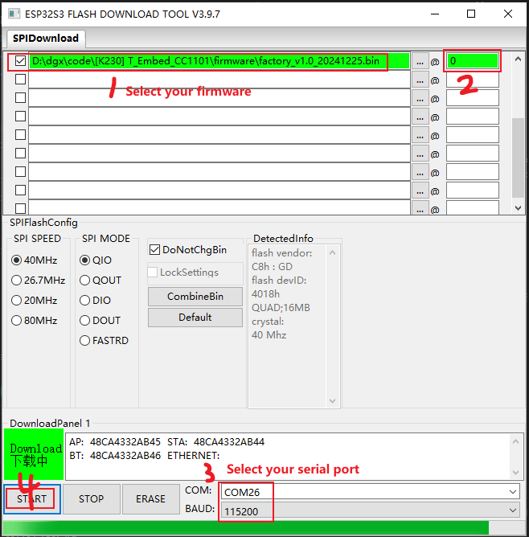

How to use the official software (`Flash Download Tools`) download program;

1、Download the `Flash Download Tools` , [Flash Download Tools](https://www.espressif.com/en/support/download/other-tools);

2、Plug in USB. T5_E-Paper_S3_Pro Enters download mode;
- :one: BOOT key without releasing it

- :two: Click the RST button on the back and release

- :three: Finally, release the BOOT key

3、Open the `Flash Download Tools` tool and select from the following figure;

4、Select the program you want to download and click `Start` key to download it as shown in the image below;

5、When the download is complete, click the `RST` button to restart the device;
